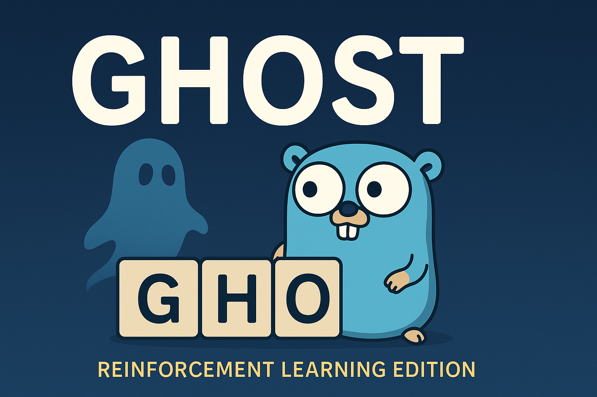

# Super Ghost game

A fun and challenging take on the classic word game **Ghost** implemented in Go. This project includes a modern GUI, a fully responsive web interface, and an AI opponent powered by reinforcement learning, making it an innovative twist on a timeless game.

---

## Table of Contents
- [About](#about)
- [Features](#features)
- [License](#license)
- [Contact](#contact)

---

## About

**Ghost Game - Reinforcement Learning Edition** is developed in Go and brings together classic gameplay mechanics with modern AI and multi-platform interfaces. Players challenge each other or the computer by adding letters to a growing sequence. The twist? The player who completes a valid word loses the round. With multiple versions like Superghost and other variants planned, the game promises both casual fun and strategic depth.

This project aims to explore:
- **Interactive UI/UX**: A desktop GUI application for an immersive experience.
- **Web Interface**: A responsive website for playing remotely.
- **Smart AI Opponent**: An AI that learns and adapts using reinforcement learning techniques.

---

## Features

- **Classic Gameplay with a Twist**: Based on the traditional rules of Ghost.
- **Graphical User Interface**: Intuitive and responsive desktop application.
- **Web Interface**: Play on the web with your browser.
- **Reinforcement Learning AI**: A smart opponent that evolves strategies over time.
- **Multiplatform Support**: Easily run on Windows, macOS, and Linux.
- **Extensible Game Modes**: Plans to support variants like Superghost, Superduperghost, and Xghost.

---

## License

This project is licensed under the MIT License.

Copyright (c) 2025 Viktor Shishmarev

---

## Credit
- [10000 most popular English words] (https://github.com/first20hours/google-10000-english)

---

## Contact

Author: Viktor Shishmarev

Github: [@shishmarevv] (https://github.com/shishmarevv)

LinkedIn: [shishmarevv](https://www.linkedin.com/in/shishmarevv/) 